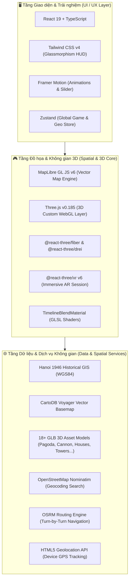

# 🏛️ Hà Nội 1946 – 2026: Timeline 3D Map & AR Spatial Experience

> **Nền tảng bản đồ số 3D sa bàn lịch sử, tương tác dòng thời gian đa thời kỳ (Dual-Era Timeline) và trải nghiệm Thực tế tăng cường (WebXR AR).**

---

## 📌 1. Giới thiệu Tổng quan Dự án

Dự án **Hà Nội 1946 – 2026** là một ứng dụng Web tương tác không gian (Spatial Web App) kết hợp giữa **Bản đồ GIS thời gian thực**, **Đồ họa 3D sa bàn thời gian thực (WebGL/Three.js)** và **Thực tế tăng cường (WebXR AR)**.

Ứng dụng cho phép người dùng:
1. **Dạo bước xuyên thời gian**: Sử dụng thanh trượt thời gian (Timeline Slider) để chứng kiến sự biến đổi cảnh quan đô thị từ **Hà Nội năm 1946** (thời điểm Toàn quốc Kháng chiến với Pháo Đài Láng, 36 Phố Phường cổ kính, Hoàng Thành Thăng Long, đồng ruộng nông thôn bao la, mạng lưới sông ngòi lịch sử) sang **Hà Nội hiện đại năm 2026** (các cao ốc chọc trời, chung cư, đại học, quy hoạch hiện đại).
2. **Đa dạng góc nhìn không gian**:
   - **Góc nhìn Sa bàn 3D (TPV - Third Person View)**: Góc nhìn toàn cảnh từ trên cao với hiệu ứng chiều sâu, ánh sáng mặt trời và bóng đổ chân thực.
   - **Góc nhìn Thứ nhất (FPV - First Person View)**: Nhập vai bước đi trên đường phố với cơ chế xoay chuột góc nhìn tự do (Pointer Lock / Mouselook) và phím di chuyển `WASD`.
3. **Thực tế tăng cường (WebXR AR)**: Đưa các di tích lịch sử và mô hình 3D đặt trực tiếp vào thế giới thực thông qua camera của thiết bị di động.
4. **Tìm kiếm địa điểm & Tìm đường thông minh**: Tích hợp công cụ định tuyến OpenStreetMap và dịch chuyển tức thời tới các địa danh lịch sử tiêu biểu.

---

## 🏗️ 2. Sơ đồ Kiến trúc Hệ thống



---

## 💻 3. Danh mục Công nghệ Chi tiết (Tech Stack Breakdown)

### 🔹 3.1. Frontend Core & Framework
* **React 19 (`react`, `react-dom` v19.2.8)**: Phiên bản React mới nhất với hiệu năng vượt trội, tối ưu hóa quá trình render các thành phần giao diện động.
* **TypeScript (~6.0.2)**: Đảm bảo tính an toàn kiểu dữ liệu (Strict Type-Safety) cho toàn bộ hệ thống tọa độ GIS, cấu trúc thực thể lịch sử và ma trận biến đổi 3D.
* **Vite 5 (`vite`, `@vitejs/plugin-react` v4.3.3)**: Bundler và Dev Server hiện đại với Hot Module Replacement (HMR) cực nhanh, phục vụ các tài nguyên tĩnh mô hình 3D dung lượng lớn một cách mượt mà.
* **Oxlint (`oxlint` v1.79.0)**: Linter hiệu năng cao bằng Rust, giữ chất lượng mã nguồn luôn sạch và đồng nhất.

---

### 🔹 3.2. Động cơ Bản đồ & Không gian GIS (Spatial GIS & Mapping Engine)
* **MapLibre GL JS (`maplibre-gl` v6.6.0)**: Thư viện bản đồ mã nguồn mở mạnh mẽ dựa trên WebGL, kết xuất bản đồ vector mượt mà ở tần số quét 60 FPS.
* **React Map GL (`react-map-gl/maplibre` v8.1.2)**: React wrapper chuẩn hóa cho MapLibre GL, cho phép nhúng các component Marker, Navigation Controls và tương tác bản đồ mượt mà.
* **CartoDB Voyager GL Vector Tile Basemap**: Cung cấp lớp nền bản đồ sắc nét, phục vụ việc truy vấn thời gian thực footprint của hàng ngàn tòa nhà.
* **Bộ dữ liệu Địa hình Lịch sử Hà Nội 1946 (WGS84 GeoJSON)**:
  - Hệ thống mặt nước cổ: Sông Nhị Hà (Sông Hồng), Sông Tô Lịch, Đầm bãi bồi Phúc Xá, Hồ Hoàn Kiếm, Hồ Trúc Bạch, Hồ Thiền Quang, Hồ Bảy Mẫu, Hồ Ba Mẫu.
  - Vùng thành quách & Cửa ô: Hoàng Thành Thăng Long (Thành Lính 1946), Đoan Môn, Kỳ Đài (Cột Cờ Hà Nội), Cửa Bắc, Cửa Đông, Ô Quan Chưởng...
  - Mạng lưới giao thông cổ: Đê Sông Hồng, tuyến Đường sắt xuyên Đông Dương và Cầu Long Biên (Paul Doumer) 1946.

---

### 🔹 3.3. Đồ họa 3D, WebGL & Custom Shaders (3D Graphics & Shaders)
* **Three.js (`three` v0.185.1)**: Thư viện WebGL hàng đầu để dựng hình, chiếu sáng, bóng đổ và quản lý cảnh 3D.
* **MapLibre Custom 3D Layer (`ThreeDModelLayer`)**:
  - Tích hợp Three.js Scene trực tiếp vào pipeline render của MapLibre GL thông qua ma trận chiếu đồng bộ (`MercatorCoordinate`).
  - Ánh sáng đa chiều: `HemisphereLight`, `AmbientLight`, `DirectionalLight` kết hợp Tone Mapping `ACESFilmicToneMapping` và sRGB Color Space cho chất lượng hình ảnh trung thực.
* **Thuật toán Khớp Footprint Tự động (Procedural Building Extrusion & Snapping)**:
  - Tự động truy vấn (Query) các đa giác vector `building` xung quanh tâm camera.
  - Tính toán trọng tâm (Centroid), diện tích (Area) và góc định hướng cạnh dài nhất (Orientation Angle).
  - Khớp và biến đổi tỉ lệ (Scale & Aspect Ratio) mô hình GLB 3D theo đúng hình dạng thực tế của tòa nhà.
* **Thuật toán Nội suy Chuyển đổi Thời kỳ (Dual-Era Interpolation & Elevation Blend)**:
  - Lắng nghe sự thay đổi của `sliderValue` thời gian thực (0: Quá khứ 1946 ⟷ 1: Hiện tại 2026).
  - Tự động điều chỉnh độ cao `scale.y` và độ hiển thị (`visible` threshold) để các công trình hiện đại hạ xuống/ẩn đi khi lùi về quá khứ và các nếp nhà tranh, di tích 1946, cánh đồng lúa bạt ngàn trỗi dậy.
* **Custom GLSL Shader (`TimelineBlendMaterial`)**:
  - Viết bằng ShaderMaterial tùy biến của Three.js / R3F để pha trộn màu sắc, grid map và hiệu ứng biến đổi hình ảnh cổ điển.
* **Hệ sinh thái Mô hình 3D (.GLB Assets)**:
  - **Di tích & Công trình công cộng**: Chùa cổ (`pagoda.glb`), Nhà thờ (`church.glb`), Trường đại học (`university.glb`), Bệnh viện (`Hospital.glb`), Trường học (`school.glb`), Siêu thị (`lowpoly_supermarket.glb`).
  - **Nhà ở & Dân cư**: Nhà phố cổ (`Town_house.glb`), Nhà ngói nhỏ (`small_house.glb`), Nhà tranh truyền thống Việt Nam (`vietnamese_house.glb`), Nhà mái rạ cổ xưa (`abandoned_house.glb`), Khu chung cư (`Appartment_building.glb`).
  - **Cao ốc hiện đại**: 3 biến thể tòa nhà chọc trời (`skycrapper_1.glb`, `Skycrapper_2.glb`, `Skycrapper_3.glb`).
  - **Cảnh quan & Lịch sử 1946**: Cánh đồng lúa bạt ngàn (`rice_field.glb`), Ụ súng pháo lịch sử Pháo Đài Láng (`cannon.glb`), Cây xanh cổ thụ (`Tree.glb`).

---

### 🔹 3.4. Thực tế Tăng cường (Augmented Reality - WebXR)
* **@react-three/fiber (`v9.7.0`)**: Bộ kết xuất Three.js khai báo theo triết lý React.
* **@react-three/drei (`v10.7.8`)**: Bộ tiện ích bổ trợ cho camera, vật liệu và điều khiển 3D.
* **@react-three/xr (`v6.6.30`)**:
  - Hỗ trợ chuẩn **WebXR Device API** với chế độ `immersive-ar`.
  - Tự động phát hiện thiết bị hỗ trợ AR (Chrome on Android, ARCore / WebXR viewers).
  - Đặt các mốc địa danh (Historical AR Anchors) với hiệu ứng làm mờ dần (Opacity Lerping) theo thời kỳ lịch sử tương ứng.

---

### 🔹 3.5. Quản lý Trạng thái & Giao diện Người dùng (State & UI/UX)
* **Zustand (`zustand` v5.0.15)**: Quản lý toàn bộ State của ứng dụng (GPS `userLocation`, trạng thái camera FPV/TPV, giá trị thanh trượt `sliderValue`, dữ liệu lộ trình `routeGeoJSON`, trạng thái AR). Tối ưu hóa hiệu năng, loại bỏ hoàn toàn hiện tượng re-render không mong muốn.
* **Tailwind CSS v4 (`tailwindcss`, `@tailwindcss/vite` v4.3.3)**: Thiết kế giao diện phẳng, hiệu ứng kính mờ (Glassmorphism HUD), hồng tâm ngắm bắn FPS và các nút điều khiển linh hoạt.
* **Framer Motion (`framer-motion` v13.1.1)**: Hiệu ứng chuyển động mượt mà cho thanh trượt thời gian `TimelineSlider` và các bảng điều khiển tìm kiếm.

---

### 🔹 3.6. Dịch vụ Định vị, Tìm kiếm & Định tuyến (Spatial Services & APIs)
* **HTML5 Geolocation API**: Tự động định vị GPS chính xác của người dùng với cơ chế fallback thông minh về trung tâm Thủ đô (Khu vực Hồ Hoàn Kiếm / Tháp Rùa).
* **OpenStreetMap Nominatim Geocoding API**: Hỗ trợ tìm kiếm địa điểm, địa danh lịch sử theo từ khóa tiếng Việt theo thời gian thực.
* **OSRM (Open Source Routing Machine) API**: Tự động tính toán đường đi ngắn nhất (Turn-by-turn driving route) giữa vị trí người chơi và địa điểm được chọn, hiển thị trực quan lớp đường đi (Polyline GeoJSON) trên sa bàn 3D.

---

### 🔹 3.7. Hệ thống Điều khiển Camera & Tương tác (Controls & Movement Engine)
* **First-Person View (FPV) & Pointer Lock API**:
  - Bấm chuột trái để khóa con trỏ chuột (`requestPointerLock`) và xoay góc nhìn 360° tự do (`mouselook` với độ nhạy `sensitivity = 0.25`).
  - Hạn chế góc ngước/cúi (`pitch` từ 0° đến 85°) tránh lật ngược camera.
* **Vòng lặp Di chuyển Game (Game Movement Loop)**:
  - Xử lý mượt mà qua `requestAnimationFrame`.
  - Hỗ trợ các phím `W`, `A`, `S`, `D` hoặc các phím mũi tên để tiến/lùi và đi ngang (Strafe) theo đúng hướng nhìn `bearing` của camera.
* **Dịch chuyển tức thời (Instant Teleportation)**:
  - Hỗ trợ các nút preset dịch chuyển nhanh: *Số 8 Pháo Đài Láng (Ụ Pháo)*, *Làng Láng & Đồng Ruộng*, *Giảng Võ - Ngọc Khánh*, *Hồ Hoàn Kiếm*, *Hoàng Thành Thăng Long*.
  - Hỗ trợ phím tắt `Shift + Click chuột phải` vào bất kỳ điểm nào trên bản đồ để dịch chuyển nhân vật ngay lập tức.

---

## 📂 4. Cấu trúc Thư mục Dự án (Project Structure)

```text
Dinh_Khac/
├── .agents/                      # AI Agent Skills & Workflows
├── specs/                        # Đặc tả kỹ thuật & kế hoạch phát triển
│   └── 001-timeline-map/         # Spec, Plan, Data Model, Contracts, Tasks
├── web-client/                   # Mã nguồn Frontend Web Application
│   ├── public/
│   │   ├── data/                 # Dữ liệu JSON tĩnh (vị trí, địa danh)
│   │   └── models/               # 18+ Mô hình 3D định dạng .GLB
│   │       ├── commercial/       # Pagoda, Church, Hospital, School, Skyscrapers...
│   │       ├── residential/      # Town house, Small house, Vietnamese house, Appartment...
│   │       ├── cannon.glb        # Ụ pháo lịch sử Pháo Đài Láng
│   │       └── rice_field.glb    # Mô hình cánh đồng lúa bao la
│   ├── src/
│   │   ├── components/
│   │   │   ├── AR/               # WebXR AR Asset Spawner & Fading Asset
│   │   │   ├── Map/              # MapLoader, ThreeDModelLayer (Three.js WebGL Layer)
│   │   │   └── UI/               # TimelineSlider, NavigationPanel, Presets
│   │   ├── data/                 # hanoi1946GeoData.ts (Dữ liệu GIS Hà Nội 1946)
│   │   ├── shaders/              # TimelineBlendMaterial (Custom GLSL Shader)
│   │   ├── store/                # gameStore.ts (Zustand Global State)
│   │   ├── types/                # TypeScript Interfaces & Data Models
│   │   ├── App.tsx               # Root Component tích hợp Map, R3F, XR & HUD
│   │   └── main.tsx              # React DOM Entrypoint
│   ├── package.json              # Khai báo thư viện & dependencies
│   ├── tsconfig.json             # Cấu hình TypeScript
│   └── vite.config.ts            # Cấu hình Vite & Tailwind Vite Plugin
└── README.md                     # Tài liệu kiến trúc & công nghệ dự án
```

---

## 🚀 5. Hướng dẫn Cài đặt & Chạy ứng dụng (Getting Started)

### Yêu cầu môi trường:
* **Node.js**: Phiên bản `>= 18.x` (khuyến nghị `20.x` hoặc `22.x`)
* **Trình duyệt**: Hỗ trợ WebGL 2.0 (Google Chrome, Microsoft Edge, Brave, Safari, Firefox). Khuyến nghị Chrome trên Android nếu muốn sử dụng tính năng **WebXR AR**.

### Các bước cài đặt:

1. **Di chuyển vào thư mục web-client**:
   ```bash
   cd web-client
   ```

2. **Cài đặt các gói phụ thuộc (Dependencies)**:
   ```bash
   npm install
   ```

3. **Khởi chạy máy chủ phát triển (Dev Server)**:
   ```bash
   npm run dev
   ```

4. **Truy cập ứng dụng**:
   - Mở trình duyệt và truy cập vào đường dẫn: `http://localhost:5173`
   - Cho phép cấp quyền vị trí GPS (hoặc hệ thống sẽ tự động định vị về trung tâm Hà Nội).
   - Kéo thanh trượt ở dưới màn hình để trải nghiệm sự biến đổi giữa **Năm 1946** và **Năm 2026**.
   - Bấm nút **"🎥 Chuyển sang Góc nhìn thứ 1"** và click chuột trái để dạo bước trong không gian 3D.

---

## 🎯 6. Điểm nổi bật về mặt Kỹ thuật (Technical Highlights)

| Tính năng | Giải pháp Kỹ thuật | Hiệu quả Đạt được |
| :--- | :--- | :--- |
| **Đồ họa Sa bàn Đa thời kỳ** | Tích hợp Three.js Custom Layer trực tiếp trong MapLibre GL qua `MercatorCoordinate` | Chạy đồng bộ trong cùng một WebGL Context, không bị lệch góc xoay hay rung lắc khi pan/zoom bản đồ |
| **Tự động Khớp Tòa nhà 3D** | Query Source Features từ Vector Tiles, phân tích hình học đa giác và gán model GLB tự động | Tái tạo đô thị 3D sống động mà không cần dựng thủ công từng khối nhà |
| **Biến đổi Dòng thời gian Mượt mà** | Real-time Lerping & Elevation Scaling dựa trên giá trị slider | Quá trình trỗi dậy của quá khứ và hạ xuống của hiện tại diễn ra tức thì ở 60 FPS |
| **Trải nghiệm Nhập vai FPV** | Pointer Lock API kết hợp Game Loop `requestAnimationFrame` và tính toán vector `bearing` | Mang lại cảm giác mượt mà như trong một tựa game 3D thế giới mở ngay trên trình duyệt web |
| **Thực tế Tăng cường AR** | Tích hợp `@react-three/xr` chuẩn WebXR `immersive-ar` | Trực tiếp đặt các di tích lịch sử và bia tưởng niệm vào không gian thực của người dùng |

